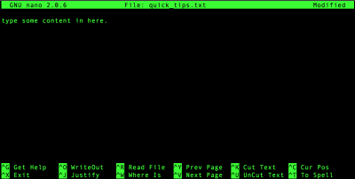

<p align="center">

</p>

# Making and Removing

In this section, we'll learn how to create or delete files and directories using LINUX commands.

## Todays objectives: 

<details>
  <summary>Click to expand/collapse</summary>

---

- **Vocabulary**
  - Source (as in the source file in a copy `cp` command)
  - Target (as in the target file in a copy `cp` command)
  - File transfer
  - File compression
  - File formats
  - Text files
  - Binary files
  - Text editor
  - File extensions
  - Checksums
  - Standard streams
  - Redirection
  - Standard input (stdin)
  - Standard output (stdout)
  - Standard error (stderr)

- **Things you should know how to do after this class**
  - Be comfortable using `cp` to copy files or directories in a few different ways (new file in the same directory, in a different directory, or with a new name)
  - Be comfortable using `mv` to move files and directories in different ways. Know the difference between `cp` and `mv`.
  - Know how to check whether your file was corrupted during transit.
  - Know the difference between text files and binary files.
  - Know that all your files should have file extensions.
  - Know a little bit about FASTA and GTF/GFF (Annotation) files
  - Know how to decompress tarballs
  - Understand what stdout, stderr, and stdin mean
  - Know how to redirect stdout, or stderr to an output file.

- **Commands covered**
  - `mv`
  - `cp`
  - `touch <filename>`
  - `nano <filename>`
  - `md5sum` or `md5` or `md5sum-lite`
  - `gzip`
  - `gunzip`
  - `>`
  - `2>`
  - `&>`
  - `>>`

---

</details>


## Reminder: 

  - HW 1 and 2 were due before class. Please turn those in
  - Quiz 2 
  - Signing up for ALPINE

----

## Sign up for an ALPINE Account

Do you have an ALPINE Account?

**NO**

  - Please sign up for one [here](https://rcamp.rc.colorado.edu/accounts/account-request/create/organization)
  - Please select **Colorado State University**
  - Please enter your e-mail as **eID@colostate.edu**
    - For example, Tony Stark has two e-mails at CSU: tony.stark@colostate.edu and tstark@colostate.edu.
    - He will use tstark@colsotate.edu
  - Please enter your password as **password,push**. 
    - For example, Tony Stark's password is `strongestavenger`. He will type in: `strongestavenger,push`

**YES**

  - Try to loging to [ALPINE ondemand](https://ondemand-rmacc.rc.colorado.edu/)
    - Pulldown ORCID and find **Colorado State University**
    - Click on **Remember This Selection**
    - Log into the CSU eID/password page as you typically do
    - DUO authenticate as you typicall do.

----
  
## Making Directories

We can make a new directory using the command `mkdir` (MaKe DIRectory):

`mkdir <newdirectoryname> …`

>[!TIP]
> The … means that you can add either one or more newdirectorynames.

:hammer_and_wrench: **Exercise:** Let's make a new directory called “mynewdir”

```
$ mkdir mynewdir
$ ls
```
----

## Removing Directories

We can remove empty directories using `rmdir` (ReMove DIRectory):

`rmdir <directoryname> …`

:hammer_and_wrench:  **Exercise:** Let's remove the “mynewdir” directory

```
$ ls
$ rmdir mynewdir
$ ls
```

Can also use `rm` (ReMove) to remove directories! However, to do so you need to use the `-d` option which specifies that you want to attempt to remove directories. Alternatively, you can use the `-R` option, or `-r` (equivilant to `-R`), which implies the `-d` option.

```
$ ls
$ rm -r mynewdir
$ ls
```

:hammer_and_wrench: **More Exercises:** 

  1. Through the terminal, navigate to the place in your computer where you want to store files for this class. If you haven't already made a directory specifically for this class, use `mkdir` to make that directory.
  2. Navigate inside your new course directory.
  3. Make some subdirectories for the course like “Assignments”, “Notes”, “Exercises”.
  4. Check out your subdirectories using `ls`
  5. Hmm, maybe those subdirectories don't sort the way you want them to. Delete the directories “Assignments”, “Notes', and “Exercises”.
  6. You can add multiple directories by listing new directory names after `mkdir` separated by spaces: `mkdir dir1 dir2 dir3`
  7. Using one `mkdir` command, make the directories “01_Notes”, “02_Exercises”, “03_Assignments”.
  8. Now `ls` to see the subdirectories. 

----

## Making Files

Files are documents that live within directories. All files in the Linux environment should follow some naming standards …

- NO spaces
- NO weird characters (A-Z, 0-9, _, - are OK)
- Should contain a file extension (.txt, .docx, .png, etc)
- Should not be the name of a function (like ls)

>[!TIP]
> If you cannot see file extensions on your computer, take a moment to make these visible:
  - [MacOS show file extensions](https://www.idownloadblog.com/2023/05/23/how-to-show-hide-filename-extensions-mac/)
  - [Windows show file extensions](https://www.howtogeek.com/205086/beginner-how-to-make-windows-show-file-extensions/)

There are many ways to make a new file. We'll cover just a few: 

### Making files with `touch`

We can make a new file with **touch**:

`touch <filename.txt>`

:hammer_and_wrench: **Exercise:** Let's navigate into your directory **01_Notes** and make the file `quick_tips.txt`.

```
$ touch quick_tips.txt
$ ls
$ ls -alh
$ more quick_tips.txt #peek into the file quick_tips.txt
```

### Writing file content with `nano`

Well, that's a pretty boring file. Let's add some content to it using the linux text editor called **nano**. This command will be different than previous commands we've executed. Instead of spitting something out to the screen below the prompt, nano will take us to a little text editor app within the terminal where we can type in some text. To exit out of nano, type CTRL+X. To save, type `y`.

`nano <filename.txt>`

It'll look like this:

<p align="center">

</p>

:hammer_and_wrench: **Exercise:** Let's add content to `quick_tips.txt` using nano:

```
$ nano quick_tips.txt
```

- Type in some content.
- Remember, to exit out of nano, CTRL+X. Then press `y` to confirm.
- Check the content using `more quick_tips.txt`.

### Making files with `nano`

We can also make new files by skipping `touch` and just starting up `nano` directly.

:hammer_and_wrench: **Exercise:** Let's make the new file `common_pitfalls.txt`.

```
$ nano common_pitfalls.txt
```

We will learn other ways to create new files in future lessons, too.

**!!! Bonus Content:** For more detailed information on Nano: [nano tutorial](../../04_resources/nano_tutorial.md)

----

## Removing Files

We can remove files using `rm` (ReMove).

`rm [-i] <filename.txt>`

`-i` is an **option** for running `rm` interactively. It requests a confirmation to remove. Please get in the habit of using this option.

>[!WARNING]
> **THERE IS NO UNDO IN LINUX**. Yep, that's right. If you remove a file, it's gone. There's no trash can or recycle bin you can pull that file out of. It is gone-gone!

**Do not combine `rm` and `*` together. It is possible to delete everything.**

>[!TIP]
> Always make sure you have a good backup system in place. A good back up system is automatic.

Let's say we don't want the file `common_pitfalls.txt` anymore.

```
$ ls
$ rm -i common_pitfalls.txt
$ ls
```

:hammer_and_wrench: **More Exercises:** 

  1. Navigate to the course directory. If you execute the `ls` command, you should see the directories "01_Notes", "02_Exercises", "03_Assignments".
  2. Navigate into "02_Exercises".
  3. Create a new file with today's date somewhere in the filename and a .txt file extension.
  4. Copy and paste the instructions for this exercise into the new text file.
  5. Use `more` to peek into your new text file.
  6. Use `rm -i` to delete your newly made text file.

---

### Removing directories and their contents with `rm`

We can also remove directories AND all their contents using `rm`:

`rm [-ir] <directoryname>`

- `-i` interactive. request confirmation to remove.
- `-r` recursive. remove entire directory and contents.
- `<directoryname>` the name of the directory you want to remove.

Always specify `-i` because there is the potential for deleting more than you bargained for.

>[!WARNING]
> Until you are at Linux ninja status, please use `-i` with all your `rm` commands. Please use caution when using `rm`. Also, please have a good backup strategy in place as well.


Continue on to [Copy and Move](2-2_Copying_and_Moving.md)
