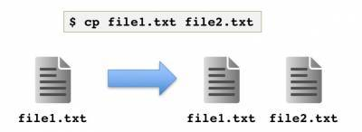

# Copying and Moving

## Copying files and directories with `cp`

The `cp` (CoPy) command is quite flexible. There are a few ways it can be used to copy a file..

  1. [Duplicating a file and giving the duplicate a new name](#duplicating-a-file-and-giving-it-a-new-name)
  2. [Duplicating a file and putting the duplicate in a new location](#duplicating-a-file-into-a-directory)
  3. [Duplicating a directory and all lits contents](#duplicating-a-directory-and-its-contents)
  4. [Copying multiple files at once](#copy-multiple-files-at-once-into-the-same-location)


----

### Duplicating a file and giving it a new name

<p align="center">

</p>

This can be used to copy the contents of a file (the source file) into a new file (the target file) with a new name:

`cp <source_file.txt> <target_file.txt>`

:hammer_and_wrench: **Exercise:** Make a backup copy of a file. Navigate into your folder `chrom_proj_`. Make a copy of `Hs_chromosome.tsv` called `Hs_chromosome_backup.tsv`.

```
$ cp Hs_chromosome.tsv Hs_chromosome_backup.tsv
$ ls
$ more Hs_chromosome.tsv #peek in the file
$ more Hs_chromosome_backup.tsv #peek in the backup
$ wc Hs_chromosome* # ensure they are the same size
```

You can think of this as basically shorthand for …

```
$ cp ./file1.txt ./file2.txt
```

You can expand the source and target names to be absolute paths, too!

```
$ cp /users/jtkirk/captainslog_2713.txt /users/jtkirk/captainslog_2714.txt
```

### Duplicating a file into a directory

Once you make the connection that names, absolute paths, or relative paths can substitute in for <source_file.txt> or <target_file.txt>, you can see how you can place the copied file in some other directory, or pull a copy of a file from a source directory into your working directory.

<p align="center">

</p>

`cp <source_file.txt> <target/path/targetname.txt>`

  - This will duplicate a file into a directory and rename it

OR

`cp <target/path/sourcename.txt> <./targetname.txt>`

  - This will duplicate a file from another directory into the current directory and rename it. 

:hammer_and_wrench: **Exercise:** Navigate into your folder `chrom_proj_`. Make a directory called `backups`. Place a copy of `Mm_chromosome.tsv` into `backups` and name it `Mm_chromosome_backup.tsv`.

```
$ mkdir backups
$ cp Mm_chromosome.tsv backups/Mm_chromosome_backup.tsv
$ ls 
$ ls backups
```

>[!TIP]
> Absolute paths as well as relative paths can be used as the source and target in `cp`.

If you want to duplicate a file into a sub-directory, you don't need to change the name. To keep the name the same ...

`cp <source_file.txt> <target_directory>`

:hammer_and_wrench: **Exercise:** Try it out

```
$ cp Dm_chromosome.tsv backups
$ ls 
$ ls backups
```

A list of files can also be copied in this way: 

`cp <source_file.txt> … <target_directory>`

– where “…” means you can keep adding additional `source_files.txt`, as many as you have.

### Duplicating a directory and its contents

Directories that contain files can also be duplicated using `cp`. Just add the option `-R`.  

```
$ cp -R backups copy_of_backups
$ ls 
$ ls backups
$ ls copy_of_backups
```

:hammer_and_wrench: **Independent Exercise:** I like to stay organized by adding notes to myself within project directories. I call these README or ABOUT files.

1. Within your directory called `chrom_proj` create a directory called `NOTES`.
2. Copy the files that beginw tih `README_` into the `NOTES` directory.

:hammer_and_wrench: **Independent Exercise:**  Add an XX genome.

1. Copy `Hs_chromosome.tsv` to a new file called `Hs_chromosome_XX.tsv`.
2. Using **nano**, go into `Hs_chromosome_XX.tsv` and delete the entry for the Y chromosome. 

> [!WARNING]
> You can't add a cursor anywhere you want. You'll need to navigate with arrow keys.


### Copy multiple files at once into the same location

If you want to copy multiple files from one loction into a different location (has to be the same location though!), you can do the following:

```
$ ls #what contents are in our parentdir? 
subdir1 file1.txt file2.txt file3.txt
$ cp file1.txt file2.txt file3.txt ./subdir1/
```

----

## Moving files and directories with `mv`

Once you know `cp`, `mv` is pretty much the same thing with one exception. The source file will **disappear** once the operation is complete. This ends up **renaming** your file if you are working within the same directory. It acts like **cut-and-paste** instead of a copy-and-paste if you're moving between directories.

<p align="center">

</p>

Again, `mv` tries to operate in slightly different ways depending on the types of arguments you give it:

| | |
|-------|------|
| **mv** <source_file.txt> <target_file.txt> | Rename source_file.txt to be called target_file.txt |
| **mv** <source_file.txt> <dir/target_file.txt> | Move source_file.txt into dir and rename it target_file.txt |
| **mv** <source_file.txt> ... <dir> | Move source_file.txt(s) into dir and keep the names the same |


:hammer_and_wrench: **Independent Exercise:**  On your own, practice using the `mv` command to rename `Cv_wuhan1_chromosome.tsv` to `Cv_chromosome.tsv`.

### Move multiple files at once into the same location

If you want to move multiple files to a new location, you can do the following:

```
$ ls 
subdir1 subdir2 file1.txt file2.txt file3.txt
$ mv file1.txt file2.txt file3.txt ./subdir1/
```

Continue on to [File Formats](2-3_File_Formats.md)
