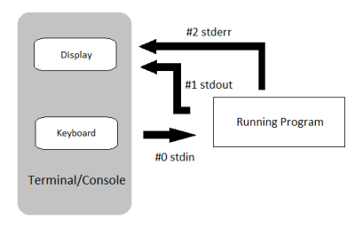

<p align="center">

</p>

# Pipes

<p align="center">

</p>

Remember our three standard streams, **stdin**, **stdout**, and **stderr**. Up to this point, we have learned to redirect stdout and stderr using `>` operators. Next, we will learn how to redirect the **stdout** of one command to directly become the **stdin** of another command. We do this using the Pipe command that is designated by the vertical line character: `|`.

We can use the pipe command between two commands to pass the output of the first command as the input of the second command. We will, in effect, be doing two steps in one.

**Pipe usage:**

`command1 | command2`

:hammer_and_wrench:  **Group Exercise:** Follow along. 

  * A commonly piped task is to count how many files are in a directory:

```
$ ls | wc
```

  * You can even count how many files of a given type are in a directory:

```
$ ls *.txt | wc
```

  * Look what happens when you try this:

```
$ ls -alh | wc
```

Where did the extra lines come from?

Continue on to [More Pipes](2-8_More_Pipes.md)
