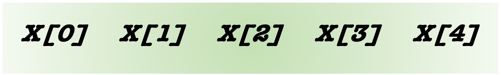

<p align="center">

</p>

----

# Array Variables

So far, we have assigned only a single value to each variable. We can also assign multiple, ordered values to a variable. These create **array variables**.

In other words, array variables have lists for values. 

Arrays are zero-based. That is, the first element is accessed with the number 0.

----

## Assigning Values to Array Variables

We assign values to an array variable using parentheses:

```
arrayname=(value1 value2 value3 value4)

# if you wanted to leave an open slot as an empty string placeholder ... you could use " " though it doesnt seem to matter if there is a space between the " " as "" also works. 

arrayname=(value1 " " value3 value4)

# if you print out all the values in this arrayvar the empty slot doesnt show up but you can still access this slot and even reassign its value!
```

---

## Dereferencing Array Variables

We can derefernce array variables in a variety of different ways.

To get the full list

```
echo ${arrayname[*]}
echo ${arrayname[@]}

echo $arrayname # Note that this doesn't work
```

:exclamation: **Recall:** We just used parentheses to capture the output of a command into a variable, but in those cases, there was an extra dollar sign in the syntax: 

```
$ myscripts=$(ls *.sh) #captures the names of scripts in a directory as the values of an array variable
 
$ echo $myscripts
 
$ myships=(enterprise discovery titan voyager) #assigns values to an array variable
 
$ echo $myships
```

:hammer_and_wrench: **Independent Exercise:** Let's explore this more. Make a bash script called `exploringArrays.sh`. Within it, create the array `ships` with four **values**. Values of array variables are also called **elements**. We can access these elements in a variety of ways:

```
#!/usr/bin/env bash
 
# Create an array variable
ships=(enterprise discovery titan voyager)
 
# Explore the elements
echo ${ships[*]} # all elements
echo ${ships[@]} # all elements
```

---

## Indexing

The process of dereferencing an individual element of an array variable is called **indexing**. Indexing relies on the fact that elements within an array have a set order. The index is the number of the element (plural is indices or indexes).. We place this number between square brackets like so...

```
# Indexing
echo ${ships[0]} # the first element
echo ${ships[1]} # the second element
echo ${ships[2]} # the third element
echo ${ships[3]} # the fourth element
```

>[!WARNING]
> In bash, Array Variable indexing starts on 0!

----

## Reassignment 

**Reassignment:** We can also use indices to add a new element to an array or to **reassign** an element of an array. Try this:

```
#!/usr/bin/env bash
 
# Create an array variable
ships=(enterprise discovery titan voyager)
 
# Explore the elements
echo ${ships[*]} # all elements
echo ${ships[@]} # all elements

# Indexing
echo ${ships[0]} # the first element
echo ${ships[1]} # the second element
echo ${ships[2]} # the third element
echo ${ships[3]} # the fourth element
 
# Add a new starship
ships[4]="excelsior"
 
echo "Added a new element: ${ships[*]}"
 
# Replace a starship
ships[1]="defiant"
 
echo "Changed an element: ${ships[*]}"
```

--- 

## How long is it?

**Length** Finally, we can assess how many elements are in an array variable using the following syntax:

```
# length of an array variable. That is, how many elements are in the array:
echo ${#ships[*]}
```

--- 

## Starting empty

Sometimes it is useful to start with an empty array and progressively add elements into it throughout our code.

Here's an example...

```
# Start with an empty array variable
crew=()

# Assign crewmembers
crew[0]="Spock"
crew[1]="Kirk"
crew[2]="McCoy"

# Dereference the array variable:
echo "There are ${#crew[*]} crewmembers: ${crew[*]}"
```

----

:hammer_and_wrench: **Independent Exercise:** What cities have you lived in and in what order?

- create an array variable called `mycities`
- Add the names of cities you have lived in as individual elements
- **Hint** use quotes to enclose values that contain spaces like “San Francisco”
- Write a little paragraph using an echo statement about your life in which you dereference the different cities using indexes.
- Your final output should read something like the below paragraph:

`“I was born in Palo Alto. I grew up in Saratoga. I moved to Santa Cruz for college. Then I lived in Eugene. Next, I moved to Berkeley for graduate school. After that, I lived in Chapel Hill. Now, I live in Fort Collins.”`

:hammer_and_wrench: **Alternative Exercise:** If you haven't lived in very many cities, that's ok. You can list cities you have visited or cities where you wish to live or visit.

Continue on to [Special Variables](3-5_Special_variables_and_IO.md)
