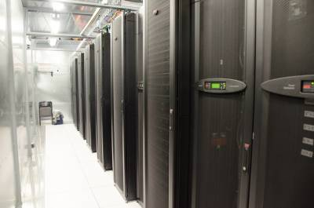
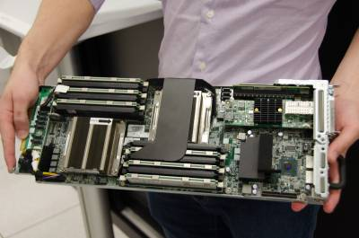
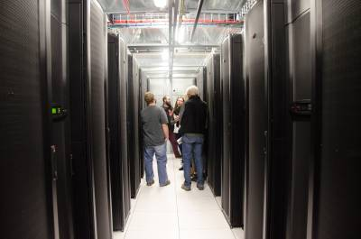
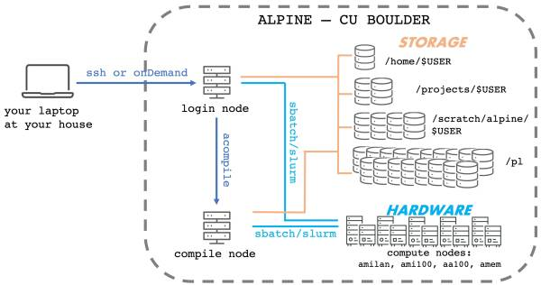
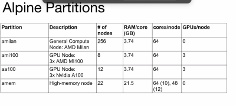
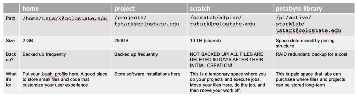

<p align="center">

</p>

# Intro to Alpine

Today, we will start to learn about **High-Performance Computing** or HPC. HPC is a means of performing large computational tasks on supercomputers or compute clusters in a way that takes advantage of their ability to perform multiple tasks simultaneously.

**Supercomputers** in the crudest terms are basically what happens if you glued 100's or 1000's of individual computers together. You end up making a giant computer with more functionality.

The supercomputer we'll be using is **ALPINE** and it lives on CU Boulder campus. [ALPINE](https://www.colorado.edu/rc/alpine) is a joint venture between Colorado State University and CU Boulder and is sponsored by those institutes and by a grant from the National Science Foundation. **ALPINE** is shared between CU Boulder, Colorado State University, CU Anschutz, and RMACC (Rocky Mountain Advanced Computing Consortium, a network of >20 other academic institutions in Colorado, Arizona, Idaho, Montana, and New Mexico).

There is a list of the [Top 500 biggest supercomputers](https://www.top500.org/lists/top500/list/2023/06/) on the planet (as of June 2026). According to this list, the largest supercomputer is **	LineShine** located in Shenzhen China and run by the China National Labs. 

How do these supercomputer systems compare to our laptops?

| Typical laptop | Alpine Supercomputer	| FRONTIER Supercomputer |
| -------------- | -------------------- | ---------------------- |
| 0.1 - 10 teraFLOPS | 5,000 teraFLOPS |	2,735,820 teraFLOPS |
| 1 - 4 cores organized onto 1 node |	32,368 cores on 485 nodes	| 13,789,440 cores |

 - **FLOPS** is a measure of how many floating point operations a computer can do per second. So it's a measure of calculations a second

 - **Cores** relates to how many CPUs (Central Processing Units) the computer has

**NOTE:** *All 500* of the top 500 Supercomputer systems run LINUX or LINUX-based operating systems!

-----

## What are the benefits and drawbacks of using a supercomputer?

### Benefits

- power, efficiency, and speed!!!
- team of professionals to help set up the system and provide user support
- allows for collaboration with other users

### Drawbacks

- There is a learning curve
- Multi-user platform requires job-sharing - there is usually a queue to execute your code
- May not have architecture specialized for your task.

----

## Resources & References

[Overview of research computing including ALPINE](https://www.colorado.edu/rc/resources)

[ALPINE quick start guide](https://curc.readthedocs.io/en/latest/clusters/alpine/index.html)

[Please cite CURC Resources to help them maintain funding!!!](https://curc.readthedocs.io/en/latest/index.html#acknowledging-rc)

[List of upcoming workshops](https://www.colorado.edu/rc/events)

[All content from past workshops!!!](https://github.com/ResearchComputing/)

-----

## Some pictures of the HPC System

This is what it looks like to walk around in ALPINE:

<p align="center">

</p>

<p align="center">

</p>

<p align="center">

</p>

---

## The ALPINE System - Mapped out

This is what ALPINE looks like mapped out:

<p align="center">

</p>

Just like your local computer, the ALPINE supercomputer is comprised of **computing hardware** (CPUs, GPUs, etc), memory, and **file storage space**.

When we log into ALPINE through ssh or onDemand, we don't immediately have access to all the parts of the ALPINE hardware. Instead, we arrive at the login node. The name of the login node is written right prior to the prompt. Typing `hostname` also gives you the name of the login node.


:hammer_and_wrench: **Group Exercise:** type `hostname`

---

## The Nodes

Detailed descriptions of [nodes](https://curc.readthedocs.io/en/latest/compute/node-types.html)

Nodes are spaces on Alpine where you can do tasks and execute jobs. Each node type has a designated purpose. Part of your job will be to learn what is appropriate behavior on the different types of nodes. We will learn about the **login nodes**, the **compile nodes**, and the **compute nodes**.

### Login nodes

When you first log into Alpine using `ssh`, you will be on a **login node**. Think of this as a lobby of a hotel. This is where you arrive first. You can do things like move and copy files, edit scripts, and execute small tasks. You should not run large jobs in the login node. You should not install software when you are here.

### Compile nodes

To move to a compile node, use the command `acompile`.

:hammer_and_wrench: **Try it** Switch over to a compile node like so …

```
$ hostname
$ acompile
$ hostname
```

When on a compile node, we can load existing software, install new software, run small jobs, and send big jobs to the compute nodes.

Let's see what software is available to load:


:hammer_and_wrench: **Try it** 

```
$ module avail
```

### Compute nodes

**Compute notes** are the most numerous nodes on the system. There are roughly 256 regular compute nodes on the ALPINE system and 42 specialized ones. The compute nodes are where big jobs will run.

To run the jobs, we will need to get in line by requesting a job through a process called **batch submission**. Depending on how many users there are and what types of jobs have already been requested to run, we will be assigned to different compute nodes when they become available. The batch submission software used by ALPINE is called **slurm** and the main command we use is `sbatch`.

Compute nodes are **multi-core processors**. This means we can run multiple jobs on one node. In the ALPINE architecture, we will mostly be using the **AMD milan** compute nodes (called `amilan`) which have 64 cores and can run up to 64 jobs simultaneously. Users can also request multiple nodes, too.

Here is an outline of the different types of compute nodes available:

<p align="center">

</p>

----

## Alpine File Storage

Detailed information about the [File Storage on Alpine](https://curc.readthedocs.io/en/latest/compute/filesystems.html)

Whereas the nodes are analogous to CPU and memory on your home laptop, the filesystem is analogous to your hard drive. This is where data will be stored. The ALPINE team has pre-organized several nice directories where each user can house their data. Each space has a designated purpose.

Here are the different file storage spaces available:

<p align="center">

</p>

:hammer_and_wrench: **Group Exercise:** Open a Jupyter Session

**Step1** Navigate to a Jupyter Session

**Step2** Navigate to your Projects Directory

**Step3** Start a project

Continue on to [Array Variables](3_6_Array_Variables.md)
