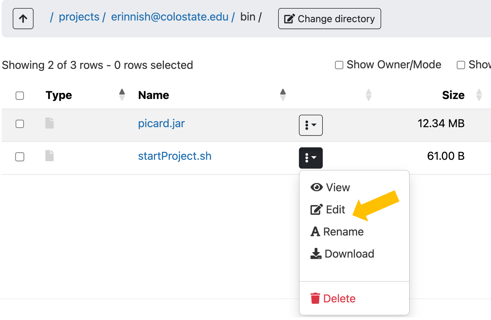

<p align="center">

</p>

---
# User-specified Custom Commands

In this section we'll learn how to convert our scripts into **custom commands**. These commands will operate like any other commands in linux, but they are things that you, the user, have written yourself. This is a way to start having the shell do exactly what you want!

Currently, we can execute our shell script two ways …
1. Within the **same directory** as the program

```
$ bash startProject.sh
```

2. From **anywhere** in our computer using an absolute path

```
$ bash /Users/name/dir1/dir2/startProject.sh
```

However, once we turn our scripts into **custom commands** we can turn our scripts into programs that more closely resemble real **commands**!

```
$ startProject
```

----

## Where should I store my scripts?

It depends on the project. Here are some options:

  - **project-specific directory**
    - good for "one off" scripts
    - For many **small, specific bash scripts**, you can keep them in the same directory as the project they were designed for.
  - **bin directory** 
    - good for **custom commands**
    - if you want your scripts to be usable throughout your computer (or HPC) environment, consider a `bin` directory. This is a user-specified directory where you collect scripts you want to use again and again.
    - On ALPINE, this `bin` directory will live within our `projects/<userid@colostate.edu>/`
    - To make these scripts so they can run anywhere, you will **add your bin directory to your PATH**
    - The **PATH** is an environmental variable
  - **github**
    - good for **custom commands**
    - For collaborative projects and work you want to publish, also consider syncing your scripts to github. 
    - This good practice for reproducibility and backup
    - For training: [coding and cookies](https://libguides.colostate.edu/coding-cookies/home)

---

## Steps for building custom commands

1. Create a `bin` directory in your `projects` directory
2. Put a script in `bin` directory
3. Make the script executable
4. Take the `.sh` off the script name
5. Add the `bin` directory to your $PATH environmental variable


## Group Exercise

:hammer_and_wrench: **Group Exercise** Let's try transforming the script `startProject.sh` into a custom command on ALPINE.

  - **file navigation**. For this, navigate to your projects directory in one tab of your internet browser like so...

<p align="center">

</p>

  - **terminal**. Also, let's open one tab as an ALPINE terminal like so...

<p align="center">

</p>

---

### 1. Create a `bin` directory in your `projects` directory

 - Navigate to your projects directory (should be `/projects/<user>`)
 - Check if you already have a dir called `bin`.
 - If not, make a new directory called `bin`
 - Make sure you know the absolute path to this directory by copying and pasting the output of the following to a textfile:

Option 1: On the terminal:

```
$ pwd
/projects/<younamehere@colsotate.edu>
$ ls

# If you have a bin directory, do nothing

# If you don't have a bin directory:
$ mkdir bin
```

Option 2: 

<p align="center">

</p>


---

### 2. Put a script in `bin` directory

 - Start a new script called `startProject.sh` 
 - Edit the `startProject.sh` file by clicking on its menu of three vertical dots.
 - Select **Edit** like so …

<p align="center">

</p>

 - copy and paste this in:

```bash
#!/usr/bin/env bash
 
# Prompt user for a project name
echo -n "startProject>>> Enter your new project name (no spaces) and press [RETURN]: "
read projectname
 
# Report progress
echo -e "startProject>>> Starting project named $projectname"
 
# Make a project directory and three subdirectories
mkdir $projectname
mkdir $projectname/01_input
mkdir $projectname/02_scripts
mkdir $projectname/03_output
 
# Start a readme file
touch $projectname/README_${projectname}.txt
 
# Add date info to readme file
echo $(date) >> $projectname/README_${projectname}.txt
 
# Report completion
echo "startProject>>> successfully completed"
```

 - Test the script in the terminal like ...

```
$ bash startProject.sh
```

OK, we've written the script. Now let's make it executable.

----

### 3. Make script executable

For more information, see [BONUS CONTENT PERMISSIONS](../../04_resources/permissions.md)

We see the permissions when we use the `ls -alh`

```
$ ls -alh
----------.  1 erinnish@colostate.edu erinnishgrp@colostate.edu  61 Sep 17 05:42 startProject.sh
```

To change the permissions, type:

```
$ chmod 740 startProject.sh
$ ls -alh
-rwxr-----.  1 erinnish@colostate.edu erinnishgrp@colostate.edu  61 Sep 17 05:42 startProject.sh
```

Now, the script has the following permissions
 - User: can read, write, and execute
 - Group: can read
 - World: cannot access

:hammer_and_wrench: **Exercise:** Test whether the file is executable by running it like so …

```
$ startProject.sh
```

----

### 4. Take the `.sh` of the script name

The last step is ...

```
$ mv startProject.sh startProject
```

---

### 5. Add the `bin` directory to your $PATH environmental variable

Recall that one of our environmental variables was called PATH:

```
$ echo $PATH
```

Your **PATH** is a list of directories where **executable binaries** (aka software) are stored. Each time you execute a command on the terminal or in a script, the shell searches for a script associated with that command name. It searches through each directory listed in the PATH. If the shell cannot find a script associated with that command name in any of those places, it cannot execute the command.

>[!WARNING]
> You do not want to mess with most of the directories listed in your PATH. They are fundamental to how your installation of LINUX runs.

>[!TIP]
> However, you can ADD a personal directory to your PATH. The shell will search through this personal directory last. By placing script files in that directory, you can execute them from anywhere in your file structure.

We add to our path by modifying one of our hidden customization files called `.bash_profile`.

- On the ALPINE terminal, navigate to your **home** directory where the `.bash_profile` file is stored.

```
$ cd
$ ls -alh
```

- Next, let's make a backup of your `.bash_profile`

```
$ cp .bash_profile 260917_bash_profile_backup.txt
```

- Now, edit your original `.bash_profile` by opening it in the FILES navigator window.
- Copy and paste the following to the `.bash_profile` file at the end ...

```
#Append paths
export PATH="/projects/<eID@colostate.edu>/bin:$PATH"
export PATH
```

- Replace `/projects/<eID@colostate.edu>/bin` with your absolute path to your own `bin` directory.

- Close out the terminal.
- Start a new terminal.
- Test it:

```
$ echo $PATH
```

>[!WARNING]
> Be very careful modifying your PATH. Make a backup of your startup files before modifying them. If something goes amiss, you can then revert to the previous startup file.


Cool! What else can I do in my `.bash_profile`? See [BONUS CONTENT: CUSTOM PROFILES](../../04_resources/customProfiles.md)

----

### Test it out!

Yay!

And that's it!

You made a brand new command! You can execute it anywhere in ALPINE using:

```
$ startProject
```


## Next time, tips, and tricks:

HOORAY!!!

>[!TIP]
> **NEXT TIME** you want to make a custom command, you'll only need to do steps 1 - 4. Because you modified your path within .bash_profile, that is permanent. You won't need to do that step again.

>[!WARNING]
> RUNNING JOBS ON ALPINE:** startProjects is a little script. It only takes a minuscule amount of compute power and speed. ALPINE people are ok with us running a command like this on the login, compile, or compute nodes immediately. However, anything bigger will require that you ask formally for resources and get in line (get in a queue). Please learn how to do this by attending their workshops or taking DSCI512: RNA sequencing. Or, you can continue on to the next pages. Enjoy! See [BONUS CONTENT: RUNNING JOBS ON ALPINE](../../04_resources/Running_jobs_on_Alpine.md) for more info.

>[!TIP]
> **BEST PRACTICE:** Put all your custom commands in the same place so you can easily find their names and modify them as need be.

>[!TIP]
> **BONUS CONTENT:** Learn how to add options and help pages to your custom commands using `getopt` or `getopts`:
- [Make options and help using getopt(s)](https://www.geeksforgeeks.org/linux-unix/getopts-command-in-linux-with-examples/)

Continue on to [Next Steps on ALPINE](4-8_Next_Steps_on_ALPINE.md)
