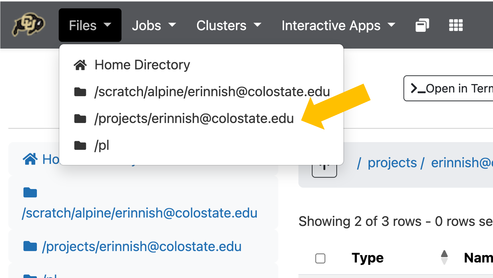
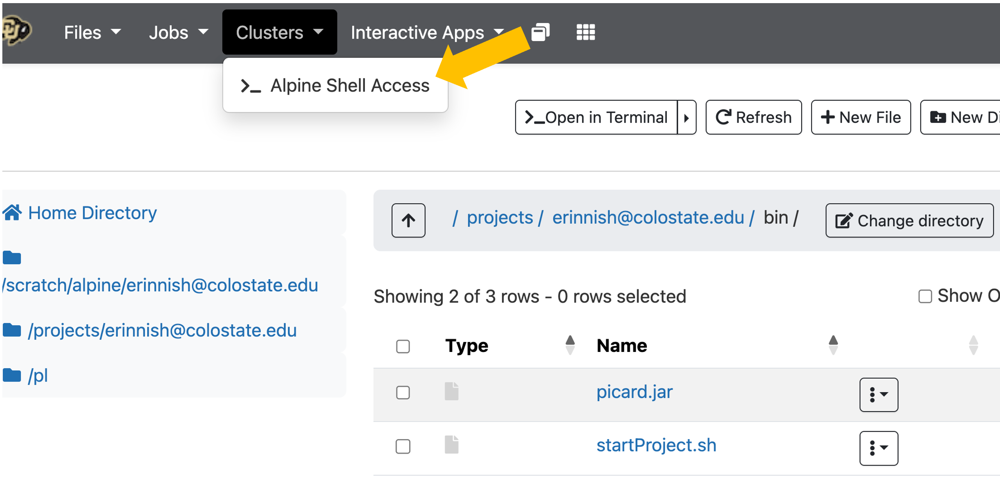
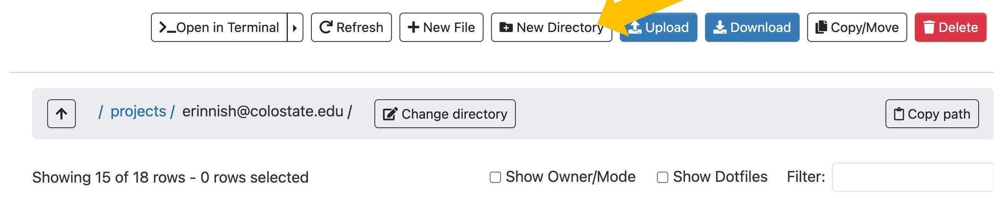
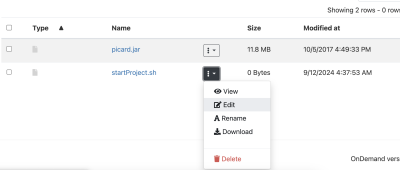

# User-specified Custom Commands

In this section we'll learn how to convert our scripts into **custom commands**. These commands will operate like any other commands in linux, but they are things that you, the user, have written yourself. This is a way to start having the shell do exactly what you want!

Currently, we can execute our shell script two ways …
1. Within the **same directory** as the program

```
$ bash startProject.sh
```

2. From **anywhere** in our computer using an absolute path

```
$ bash /Users/name/dir1/dir2/startProject.sh
```

However, once we turn our scripts into **custom commands** we can turn our scripts into programs that more closely resemble real **commands**!

```
$ startProject
```

----

## Where should I store my scripts?

It depends on the project. Here are some options:

  - **project-specific directory**
    - good for "one off" scripts
    - For many **small, specific bash scripts**, you can keep them in the same directory as the project they were designed for.
  - **bin directory** 
    - good for **custom commands**
    - if you want your scripts to be usable throughout your computer (or HPC) environment, consider a `bin` directory. This is a user-specified directory where you collect scripts you want to use again and again.
    - On ALPINE, this `bin` directory will live within our `projects/<userid@colostate.edu>/`
    - To make these scripts so they can run anywhere, you will **add your bin directory to your PATH**
    - The **PATH** is an environmental variable
  - **github**
    - good for **custom commands**
    - For collaborative projects and work you want to publish, also consider syncing your scripts to github. 
    - This good practice for reproducibility and backup
    - For training: [coding and cookies](https://libguides.colostate.edu/coding-cookies/home)

---

## Steps for building custom commands

1. Create a `bin` directory in your `projects` directory
2. Put a script in `bin` directory
3. Make the script executable
4. Take the `.sh` off the script name
5. Add the `bin` directory to your $PATH environmental variable


## Group Exercise

:hammer_and_wrench: **Group Exercise** Let's try transforming the script `startProject.sh` into a custom command on ALPINE.

  - **file navigation**. For this, navigate to your projects directory in one tab of your internet browser like so...

<p align="center">

</p>

  - **terminal**. Also, let's open one tab as an ALPINE terminal like so...

<p align="center">

</p>

### 1. Create a `bin` directory in your `projects` directory

 - Navigate to your projects directory (should be `/projects/<user>`)
 - Check if you already have a dir called `bin`.
 - If not, make a new directory called `bin`
 - Make sure you know the absolute path to this directory by copying and pasting the output of the following to a textfile:

Option 1: On the terminal:

```
$ pwd
/projects/<younamehere@colsotate.edu>
$ ls

# If you have a bin directory, do nothing

# IF you don't have a bind directory:
$ mkdir bin
```

Option 2: 

<p align="center">

</p>


---

### 2. Put a script in `bin` directory

 - Start a new script called `startProject.sh` 
 - Edit the `startProject.sh` file by clicking on its menu of three vertical dots.
 - Select **Edit** like so …

<p align="center">

</p>

 - copy and paste this in:

```
#!/usr/bin/env bash
 
# Prompt user for a project name
echo -n "startProject>>> Enter your new project name (no spaces) and press [RETURN]: "
read projectname
 
# Report progress
echo -e "startProject>>> Starting project named $projectname"
 
# Make a project directory and three subdirectories
mkdir $projectname
mkdir $projectname/01_input
mkdir $projectname/02_scripts
mkdir $projectname/03_output
 
# Start a readme file
touch $projectname/README_${projectname}.txt
 
# Add date info to readme file
echo $(date) >> $projectname/README_${projectname}.txt
 
# Report completion
echo "startProject>>> successfully completed"
```

Let's test whether our script works.

- Open a cluster by selecting **Clusters** menu
- Select **>ALPINE Shell Access**
- Navigate to `/projects/<user>/bin`
- test code

```
$ bash startProject.sh
```

**Review:** These were our steps ...

1. Create a `bin` directory in your `projects` directory
2. Put a script in `bin` directory
3. Make the script executable
4. Take the `.sh` off the script name
5. Add the `bin` directory to your $PATH environmental variable

OK, we've written the script. Now let's make it executable.

----

### 3. Make script executable

We see the permissions when we use the `ls -alh`

```
$ ls -alh
----------.  1 erinnish@colostate.edu erinnishgrp@colostate.edu  61 Sep 17 05:42 startProject.sh
```

To change the permissions, type:

```
$ chmod 740 startProject.sh
$ ls -alh
-rwxr-----.  1 erinnish@colostate.edu erinnishgrp@colostate.edu  61 Sep 17 05:42 startProject.sh
```

Now, the script has the following permissions
 - User: can read, write, and execute
 - Group: can read
 - World: cannot access

For more information, see [BONUS CONTENT PERMISSIONS](../../04_resources/permissions.md)

:hammer_and_wrench: **Exercise:** Test whether the file is executable by running it like so …

```
$ startProject.sh
```

----

### 4. Take the `.sh` of the script name

The last step is ...

```
$ mv startProject.sh startProject
```

---

### 5. Add the `bin` directory to your $PATH environmental variable

Recall that one of our environmental variables was called PATH:

```
$ echo $PATH
```

Your **PATH** is a list of directories where **executable binaries** (aka software) are stored. Each time you execute a command on the terminal or in a script, the shell searches for a script associated with that command name. It searches through each directory listed in the PATH. If the shell cannot find a script associated with that command name in any of those places, it cannot execute the command.

>[!WARNING]
> You do not want to mess with most of the directories listed in your PATH. They are fundamental to how your installation of LINUX runs.

>[!TIP]
> However, you can ADD a personal directory to your PATH. The shell will search through this personal directory last. By placing script files in that directory, you can execute them from anywhere in your file structure.

We add to our path by modifying one of our hidden customization files called `.bash_profile`.

- First, navigate to your **home** directory where the `.bash_profile` file is stored.

```
$ cd
$ ls -alh
```

- Next, let's make a backup of your `.bash_profile`

```
$ cp .bash_profile 260917_bash_profile_backup.txt
```

- Now, edit your original `.bash_profile` by opening it in the FILES navigator window.
- Copy and paste the following to the `.bash_profile` file at the end ...

```
#Append paths
export PATH="/projects/<eID@colostate.edu>/bin:$PATH"
export PATH
```

- Replace `/projects/<eID@colostate.edu>/bin` with your absolute path to your own `bin` directory.

- Close out the terminal.
- Start a new terminal.
- Test it:

```
$ echo $PATH
```

>[!WARNING]
> Be very careful modifying your PATH. Make a backup of your startup files before modifying them. If something goes amiss, you can then revert to the previous startup file.


Cool! What else can I do in my `.bash_profile`?

<details>
  <summary>Quick PATH modifications</summary>

---

**example .bash_profile modifications**

```
# Change colors so they look cooler:
export CLICOLOR=1
export LSCOLORS=GxFxBxDxGxegedabagacad
 
# My prompt: 
# Change the color of the prompt: 
export PS1="\[\033[36m\]\u\[\033[m\]@\[\033[32m\]\h:\[\033[33;1m\]\w\[\033[m\]\$ "
# Make my prompt shorter - good for teaching:
PS1='\u:\W\$ '
 
# My aliases
alias srm='rm -i'
```

More references here:
- [Guide to editing the prompt](https://phoenixnap.com/kb/change-bash-prompt-linux)
- [How to change colors](https://www.howtogeek.com/307899/how-to-change-the-colors-of-directories-and-files-in-the-ls-command/)
  - Note: the variable is LSCOLORS on Alpine, not LS_COLORS as in their tutorial

---

</details>

<details>
  <summary>Edit your .bash_profile</summary>

---

**!!! Warning:** Be very careful modifying your PATH. Make a backup of your startup files before modifying them. If something goes amiss, you can then revert to the previous startup file.

Update $PATH environmental variable …
- Navigate to home directory using `$ cd`
- See if there is already a file called `.bash_profile`
  - If one already exists, make a backup of it using `$ cp .bash_profile bash_profile_backup.txt`
  - If it doesnt exist, make one using `$ touch .bash_profile`
- Edit the bash profile to inlcude the name of your new scripts path. For example: `Users/jesshill/myscripts`

```
export PATH="/Users/jesshill/myscripts:$PATH"
```

- for yours, if your path (use pwd to check) is <mypath>, put it in here where <mypath> is the absolute path of your scripts directory.

```
export PATH="<mypath>:$PATH"
```

To enact the changes, either close and re-open the terminal OR type:

```
$ source .bash_profile
```

**!!! Warning:** 
- Please be very careful with this. You can really alter your computer's behavior this way. Test this out on ALPINE first before you try this on your own laptop.
- Before changing your `.bash_profile`, make a backup.
- If you have run into some trouble doing this, just delete the `.bash_profile` file and re-start the terminal. Or, revert to a backed up `.bash_profile` and re-start the terminal.

** Other fun things you can do with .bash_profile**

The `.bash_profile` file executes every time you open a new terminal window. So, you can put lots of cool stuff in here like your alias commands. You can also customize the colors of your terminal.

```
# My custom paths
export PATH="<mypath>:$PATH"
 
# My alias commands:
alias srm='rm -i'
 
# Change my colors so they look cooler:
export PS1="\[\033[36m\]\u\[\033[m\]@\[\033[32m\]\h:\[\033[33;1m\]\w\[\033[m\]\$ "
export CLICOLOR=1
export LSCOLORS=ExFxBxDxCxegedabagacad
```

---

</details>

<details>
  <summary>Using variables in your environment</summary>

---
  
**Changing settings in your environment**

Now that we've had practice with variables, and seen some environmental variables, let's explore how `ls` uses an environmental variable to color its output.

Maybe you already have it, to check, do:

```
printenv | grep COLOR
```

Does anyone have any output from this?

If you already do, then it's being set somewhere, which is fine. This next lesson will show you how to configure it.

**Background**

On linux, doing `ls –color` tells ls to look at the environmental variable `LS_COLORS` for settings on how to color directories, links, executable files, and other more advanced types of files.

On BSD (Macs), `ls -G` does the same, but it looks for the variable `LSCOLORS`.

Usually, these flags are supplied in the alias. Do:

```
alias ls
```

to see if you have the flag set. If not, do:

```
# linux (Windows Ubuntu)
alias ls='ls --color'
 
# BSD (Mac Terminal)
alias ls='ls -G'
```

This insures that `ls` will color its output, and is probably already set for you. If you like how it colors its output already, that's OK, we're just tinkering for now.

**Syntax of `LSCOLORS/LS_COLORS`**

This has to be a value of a variable, so it will be a long string, which means a lot of abbreviation.

Example: `LSCOLORS=Exfxcxdxbxeggaabagacad`

Example: `di=1;34:ln=35:so=32:pi=33:ex=31:bd=34;46:cd=36;40:su=30;41:sg=30;46:tw=30;42:ow=30;43`

This is hard (or time consuming) to deal with, so let's use a utility to generate the code.

**Exercise**

go to [Geoff Greer](https://geoff.greer.fm/lscolors/) to see how the settings change with different highlights.

<p align="center">

</p>

**Syntax**

BSD: 
```
# BSD
LSCOLORS=CODE
# example
LSCOLORS=exfxcxdxbxegedabagacad
 
export LSCOLORS # only has to happen once
 
# Linux:
LS_COLORS='CODE IN QUOTES'
# example
LS_COLORS='di=34:ln=35:so=32:pi=33:ex=31:bd=34;46:cd=34;43:su=30;41:sg=30;46:tw=30;42:ow=30;43'
 
export LS_COLORS # only has to happen once
```

**Try it!**

1. Change the foreground color of directories,
2. paste in the new code using the syntax above.
3. use `ls` in your home directory to test it out
4. Try changing the background color of the “directory"

**Other file types - for the curious**

If you want to test the display of other file types, you have to look in system directories.
- /dev should have symbolic links, and character and block special files
- /bin /usr/sbin, some have the set-uid/set-gid

**Saving changes to your environment**

Everything is saved in configuration files or scripts, and executed when you login, or open a new terminal.

Let's make a new configuration file called `colors.rc` (.rc is a convention for config file extensions).

```
$ nano colors.rc
```

1. Set the value of LSCOLORS or LS_COLORS in the file, as you did in the terminal.
2. You **do** need to export the variable again. `export LSCOLORS`
3. Almost there - colors.rc has to be `sourced` during login.
4. `source colors.rc` must be placed at the very bottom of your login startup file:
  - bash: `.bash_profile`
  - zsh: `.zshrc`
  - Create the file if it doesn't exist.
5. Open a new terminal window (ctrl-alt-t Windows) (command-t Mac) and see if the list colors are defined.

---

</details>


Recall our steps:

1. Add the `bin` directory to your `$PATH`
2. Put script in `bin` directory
3. Make script executable
4. Take the `.sh` off the script name

Yay! Now we don't need to use the `bash` command to execute the `startProject.sh` script. We can just execute it by either 1) going to the directory where the script lives and typing `startProject.sh`.

Because this script is in our special `bin` directory that lives in our path, we can use it ANYWHERE in our file structure and execute this script. Try it from your home directory …

And that's it!

You made a brand new command! You can execute it anywhere in ALPINE using:

```
$ startProject
```

HOORAY!!!

**!!! NEXT TIME** you want to make a custom command, you'll only need to do steps 1 - 3. Because you modified your path within .bash_profile, that is permanent. You won't need to do that step again.

**!!! BEST PRACTICE:** Put all your custom commands in the same place so you can easily find their names and modify them as need be.

**!!! BONUS CONTENT:** Learn how to add options and help pages to your custom commands using `getopt` or `getopts`:
- [Make options and help using getopt(s)](https://www.geeksforgeeks.org/linux-unix/getopts-command-in-linux-with-examples/)

**!!! RUNNING JOBS ON ALPINE:** startProjects is a little script. It only takes a minuscule amount of compute power and speed. ALPINE people are ok with us running a command like this on the login, compile, or compute nodes immediately. However, anything bigger will require that you ask formally for resources and get in line (get in a queue). Please learn how to do this by attending their workshops or taking DSCI512: RNA sequencing. Or, you can continue on to the next pages. Enjoy!

Continue on to [Running jobs on Alpine](4-7_Running_jobs_on_Alpine.md)
