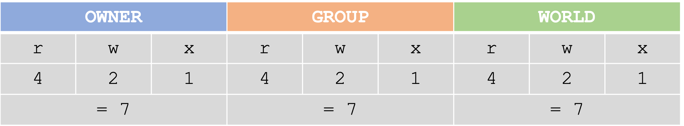
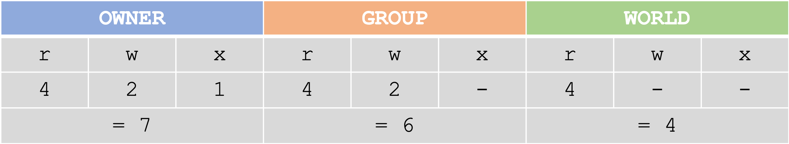
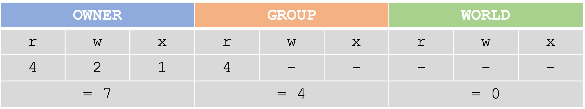

# Permissions

---

## User types

Unix/Linux are designed as multi-user systems and it provides mechanisms for managing that. One aspect of that is that file ownership. Every file and directory has an owner. The **owner** of a file/directory can control who has what type of access to it. The other users can belong to another **group** or the rest of the **world**. Three user types:

- **owner**
- **group**
- **world**

---

## Permission types

We can specify what different users have permission to do to a file or directory. These privileges are:

- **read** - read privileges mean that users can open a file and read it, but cannot make changes.
- **write** - write privileges allow a user to make changes to it.
- **execute** - execution privileges allow a user to execute a code, script, or program.

---

## Checking permissions with `ls -l`

Permission codes are displayed for files and directories using `ls -l`:

```
erinnish@cray2:~/lustrefs> ls -alh
total 56K
drwxr-----   6 erinnish onishlab 4.0K Feb 29  2016 .
drwxr--r-- 625 root     root      36K Jul 26 15:37 ..
drwxr--r--   2 erinnish onishlab 4.0K Feb 22  2016 1_EXECUTABLES
drwxr--r--   3 erinnish onishlab 4.0K Feb 28  2016 2_RAWFILES
drwxr--r--   4 erinnish onishlab 4.0K Apr 25 11:56 3_PROJECTS
drwxr--r--   4 erinnish onishlab 4.0K Mar  4 09:53 4_SEQUENCES
```

The codes `drwxrwxrwx` stand for directory, read, write, execute, read, write, execute, read, write, execute. Disregarding the **d** for directory, the first set of permissions refer to what the **user** can do, the second to what the **group** can do, and the third to what the **others** can do.

If the letter `w`, `r`, or `x` is present, it meant that user has that permission. A `-` represents a permission that is **NOT** granted.

---

## Changing permissions with chmod

If I want to change the permissions of a file or directory in my file structure, I can do so with chmod.

**chmod Usage:** 

`chmod [nnn] <file.txt/dir> …`

[nnn] - where nnn is a three number code specifying the desired permission string.

The three number code string is a clever way to specify the permissions for the **owner, group, and world**. If I want all three user groups to have read, write, and execution privileges, the code string is 777:

**!!! EXAMPLES:** To change a file to this permission code …

<p align="center">

</p>

… we would type:

```
$ chmod 777 file.txt
```

Another example:

<p align="center">

</p>

```
$ chmod 764 file.txt
```

And another:

<p align="center">

</p>

```
$ chmod 740 file.txt
```

**!!! Exercise:** To explore aspects of chmod, let's use a program that is executable. Make a file called `hello_user.sh`. Copy and paste the following content into this file.

```
#!/bin/bash
 
#Prompt for name:
echo "What is your name?"
 
# get name from stdin. Call it varname
read varname
 
#say hello
echo "Why hello there, $varname!"
```

Let's see if we can execute this code:

```
$ls -alh # check the current permissions for hello_user.sh
$bash hello_user.sh # Try to execute the code explicitly
$./hello_user.sh # Try to execute the code with executable permissions
```

Did it work? Probably not if you don't have executable permissions. Let's change the permissions.

```
$chmod 744 hello_user.sh #change permissions to owner executable
$./hello_user.sh
```

Did it work?

**!!! Quick tip:** 
- If it didn't work, don't fret. It is possible your system does not store its bash program in /bin/bash. To check this, type which $SHELL. Replace whatever is displayed to the screen within the code in place of `/bin/bash`. Try again.
- There are many more ways of executing chmod. Some of these are very intuitive and may be easier to learn. Please read Chapter9 of the text book to see these alternative techniques.

You can also use **alphabetic change codes**! There are many allowable syntaxes for changecodes.

```
chmod u+x file.sh #allow the user/owner to execute file.sh
$ chmod u-x file.sh #remove permission for user/owner to execute file.sh
$ chmod g+wx file.sh #allow the group to write and execute file.sh
$ chmod g-wx file.sh # remove permission for group to execute file.sh
$ chmod o+rwx file.sh #allow others to read, write and execute file.sh
$ chmod o-rwx file.sh # remove permission for others to read, write, and execute file.sh
```